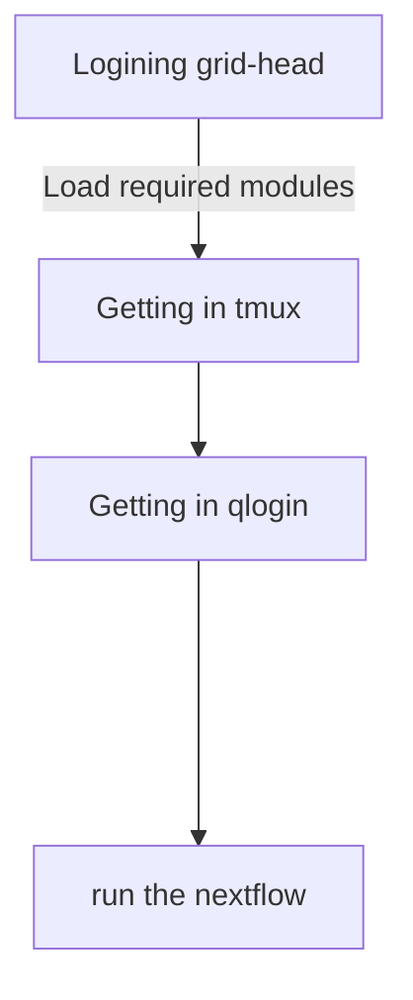

# bbi-sge

## Flowchart

## Intro

**SGE PIPELINE**

    How to run the pipeline:
    1. Logining grid-head
    2. Getting in tmux
    3. Getting in qlogin
    4. run the nextflow

Detail description of each steps

    1. Login to gs cluster
    2. Getting in tmux session 
        load required modules based on the next section
        tmux 
        tmux attach (only if you want to go to current working session after disconnected)
    3. Getting in qlogin with amout of memory you want
        qlogin -l mfree='32G'
    4. Running the nextflow
        nextflow run bbi-sge -c <config name>.config 

## Required Modules

First things that you should do is loading modules mannually. 
All the required modules except tmux are loaded within the nextflow.config and main.nf.
However, in somecases, it would show the error message related to this.  

To avoid this, it is highly recommneded to load following modules before running nextflow
    module load gmp/6.1.2 mpfr/4.0.1 mpc/1.1.0 gcc/8.1.0 bcl2fastq/2.20 
    module load java/1.8.0 fastqc/0.11.7 EMBOSS/6.6.0

General modules 
You are required to load following modules first to load any other modules in the cluster.
    module load modules modules-init modules-gs  
    
You are required to load following moduels to use tmux session.  
    module load libevent/2.1.8 tmux/2.8

## Installation
1. You need to git clone follwing:
    module load git/2.18.0
    git clone https://github.com/bbi-lab/bbi-sge.git

2. Download nextflow inside of bbi-sge folder   
    curl -fsSL https://get.nextflow.io | bash
    
Now, you can look up the params.config file to change parameters (you can change name of params.config file whatever you want it).
Information about what each parameters for are descripted in config file.

## Extra Features
Those are implanted features on nextflow that can be useful to run the pipeline.

    1. resume  
    This will resume the pipeline from where the problem arise after fixing the problem.

    nextflow run bbi-sge -c <config name> -resume

    2. notification  
    You can put tagging on the command line to get a notification when you are done 

    nextflow run bbi-sge -c <config name> -N <recipient address>
