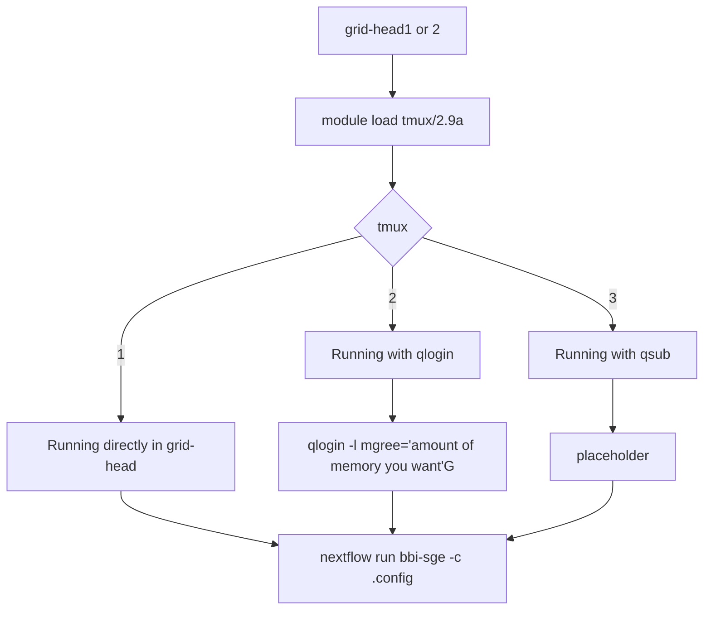

# bbi-sge

## Flowchart

## Intro

**SGE PIPELINE**

    Useage:
    ssh uw-id@grid-head1 or 2
    module load tmux/2.9a 
    tmux

After upper steps, you can run the pipeline by 3 different ways

    1. Running directly in grid-head 
        ./nextflow run main.nf -c <config name>.config 

    2. Runnign in qlogin
        qlogin -l mfree='16G' ; put how much memory you want
        ./nextflow run main.nf -c <config name>.config 

    3. Running in qsub
        qsub ./nextflow run main.nf (working?)

    
## Requirements
Nextflow runs in its own work directory and its sub directories, and it automatically generate the .log files.  
To track them easily, it is highly recommended to make own nextflow directory and then pull the git-hub respitory inside of that directory.
    
    git clone https://github.com/bbi-lab/bbi-sge.git
  
    curl -fsSL https://get.nextflow.io | bash
    ./nextflow pull bbi/bbi-sge

Now, you can look up the params.config file to change parameters (you can change name of params.config file whatever you want it).
Information about what each parameters for are descripted in config file.

## Modules
If you have problems to run the pipeline. 

First things that you should do is loading modules mannually. 
All the required modules are loaded within the nextflow.config and main.nf, so you do not need to load modules.
However, in somecases, it would show the error message realted tro this.  

To avoid this,you can mannually load following modules before running nextflow  

Realtaed module commands
    module list - show up loaded modules 

    module load modules modules-init modules-gs 
    module load libevent/2.1.8 tmux/2.8
    module load gmp/6.1.2 mpfr/4.0.1 mpc/1.1.0 gcc/8.1.0 bcl2fastq/2.20 
    module load java/1.8.0 fastqc/0.11.7 EMBOSS/6.6.0

## Extra Features
Those are implanted features on nextflow that can be useful to run the pipeline.

    1. resume  
    This will resume the pipeline from where the problem arise after fixing the problem.

    nextflow run bbi-sge -c <config name> -resume

    2. notification  
    You can put tagging on the command line to get a notification when you are done 

    nextflow run bbi-sge -c <config name> -N <recipient address>
